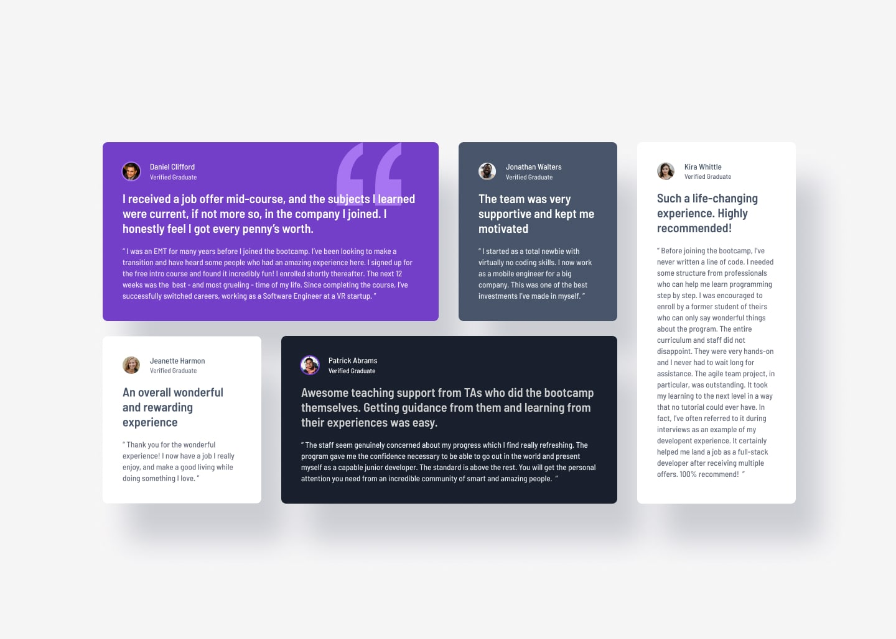

# Frontend Mentor - Testimonials grid section

This is my solution to the **Testimonials grid section** challenge on Frontend Mentor.

The goal of this project was to recreate the multi-column card layout using semantic HTML and CSS Grid, ensuring responsive behavior across both mobile and desktop screens.

## 📸 Screenshot



## 🔗 Links

- **Live Site:** https://lumine404.github.io/frontendmentor-testimonials-grid-section/
- **Frontend Mentor Solution:** https://www.frontendmentor.io/profile/lumine404
- **Repository:** https://github.com/lumine404/frontendmentor-testimonials-grid-section

## 🚀 Built With

- Semantic HTML5 markup
- CSS3 Custom Properties (`var(--variables)`)
- CSS Grid (2D multi-column & row spanning)
- CSS Flexbox
- Mobile-First Workflow
- Google Fonts (`Barlow Semi Condensed`)

## 🎯 What I Learned

This project helped me improve my understanding of:

- Structuring a complex 2D layout using **CSS Grid** (`grid-template-columns: repeat(4, 1fr)`).
- Spanning elements across multiple columns (`grid-column: 1 / 3`) and rows (`grid-row: 1 / 3`).
- Overlays and stacking contexts using `position: absolute` alongside `z-index` layering for decorative SVGs.
- Using semantic inline elements (`<span>`) for sub-headings instead of line-break tags (`<br>`).
- Managing component colors cleanly with CSS Custom Properties (`:root` variables).

## 💡 Key CSS Code Snippet

```css
/* Desktop 4-Column Grid Mapping */
@media (min-width: 900px) {
    main {
        display: grid;
        grid-template-columns: repeat(4, 1fr);
        grid-template-rows: auto auto;
        gap: 1.5rem;
    }

    #first {
        grid-column: 1 / 3;
        grid-row: 1;
    }

    #fifth {
        grid-column: 4;
        grid-row: 1 / 3; /* Spans across both rows */
    }
}
```

## 💡 Challenges

Some challenges I encountered while building this project included:

Understanding how grid line numbers work (start / end) when spanning cards across multiple columns or rows.
Placing decorative background SVGs behind card text using position: absolute and explicit z-index values.
Preventing content shift and overflow when transitioning between single-column mobile views and multi-column desktop layouts.

## 🔮 Future Improvements

For future projects, I want to continue improving my:

Mastery of grid-template-areas as an alternative to line-based grid positioning.

Advanced layout strategies for fluid typography and spacing without rigid media query breakpoints.

Accessibility practices, including appropriate aria- labels for screen readers.

👤 Author
**Serine (Lumine)**

- GitHub: https://github.com/lumine404
- Frontend Mentor: https://www.frontendmentor.io/profile/lumine404

Frontend Mentor: @lumine404